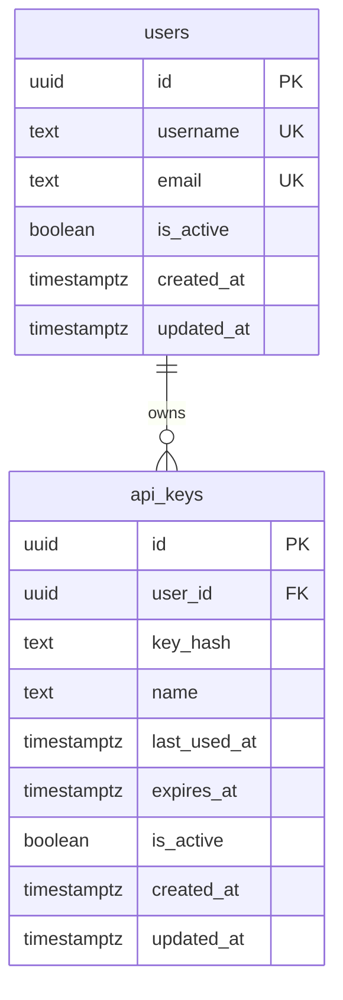
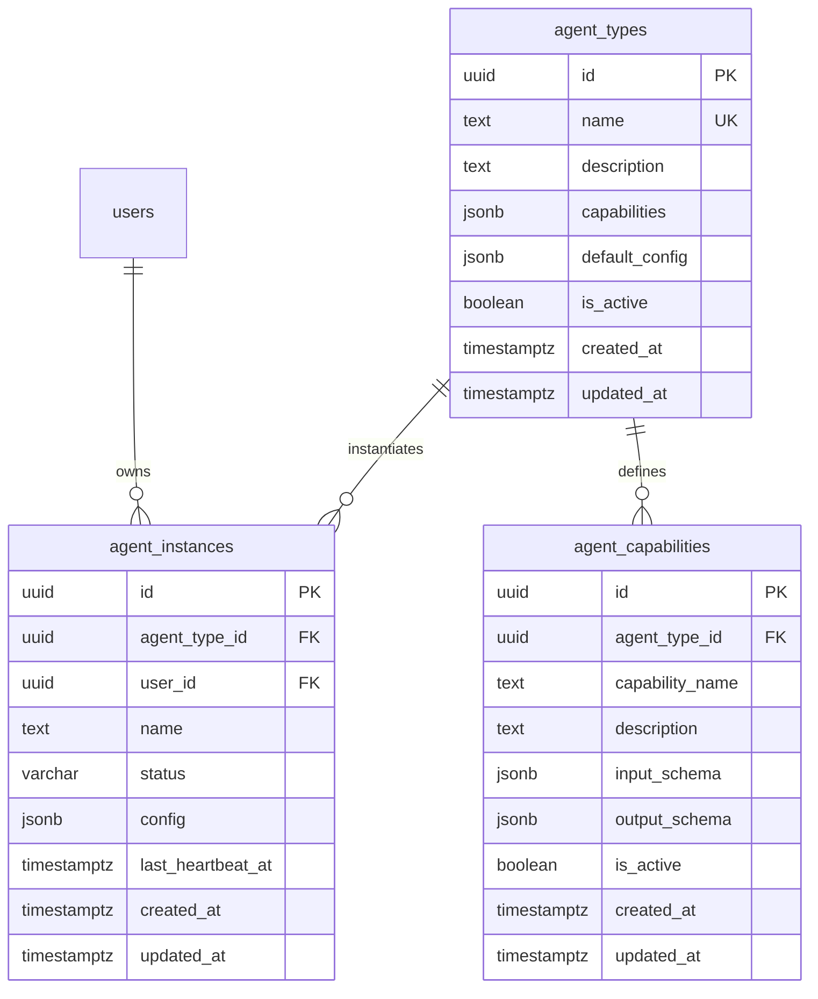
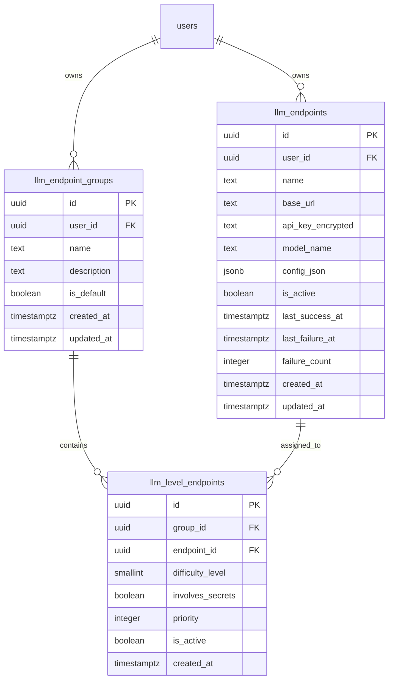
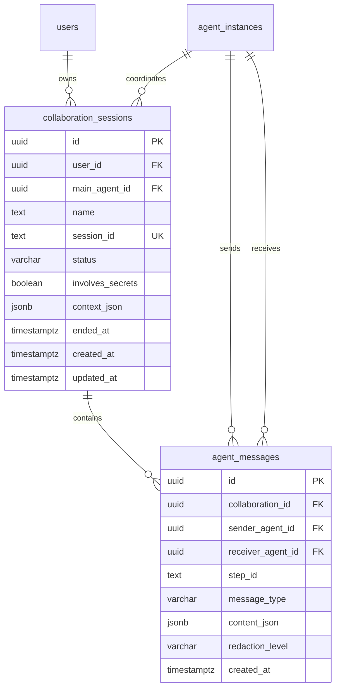
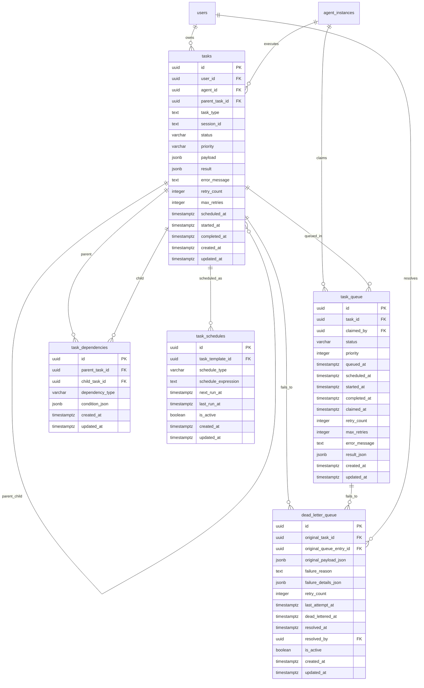
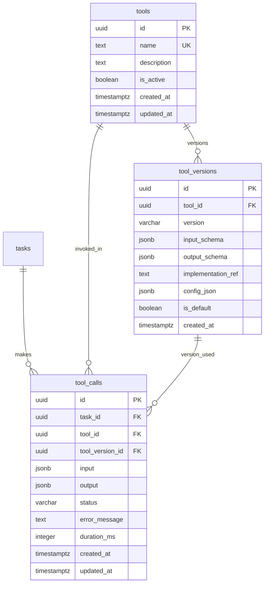
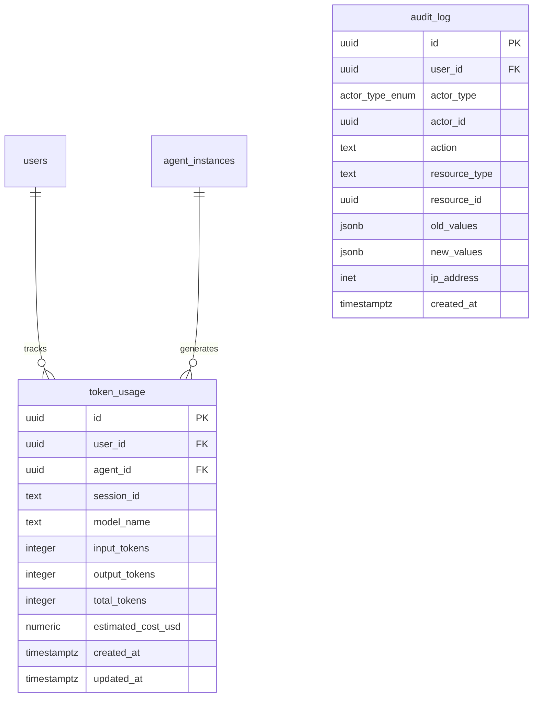

# Database Entity-Relationship Diagram (ERD)

This document provides a visual representation of the Agent Server database schema using Mermaid diagrams.

## Overview

The Agent Server database consists of **19 tables** organized into logical domains:
- **User Management**: users, api_keys
- **Agent System**: agent_types, agent_instances, agent_capabilities
- **LLM Configuration**: llm_endpoint_groups, llm_endpoints, llm_level_endpoints
- **Collaboration**: collaboration_sessions, agent_messages
- **Task Management**: tasks, task_dependencies, task_schedules, task_queue, dead_letter_queue
- **Tool System**: tools, tool_versions, tool_calls
- **Observability**: token_usage, audit.audit_log

## Complete Entity-Relationship Diagram

```mermaid
erDiagram
    %% User Management Domain
    users {
        uuid id PK
        text username UK
        text email UK
        boolean is_active
        timestamptz created_at
        timestamptz updated_at
    }
    
    api_keys {
        uuid id PK
        uuid user_id FK
        text key_hash
        text name
        timestamptz last_used_at
        timestamptz expires_at
        boolean is_active
        timestamptz created_at
        timestamptz updated_at
    }
    
    %% Agent System Domain
    agent_types {
        uuid id PK
        text name UK
        text description
        jsonb capabilities
        jsonb default_config
        boolean is_active
        timestamptz created_at
        timestamptz updated_at
    }
    
    agent_instances {
        uuid id PK
        uuid agent_type_id FK
        uuid user_id FK
        text name
        varchar status
        jsonb config
        timestamptz last_heartbeat_at
        timestamptz created_at
        timestamptz updated_at
    }
    
    agent_capabilities {
        uuid id PK
        uuid agent_type_id FK
        text capability_name
        text description
        jsonb input_schema
        jsonb output_schema
        boolean is_active
        timestamptz created_at
        timestamptz updated_at
    }
    
    %% LLM Configuration Domain
    llm_endpoint_groups {
        uuid id PK
        uuid user_id FK
        text name
        text description
        boolean is_default
        timestamptz created_at
        timestamptz updated_at
    }
    
    llm_endpoints {
        uuid id PK
        uuid user_id FK
        text name
        text base_url
        text api_key_encrypted
        text model_name
        jsonb config_json
        boolean is_active
        timestamptz last_success_at
        timestamptz last_failure_at
        integer failure_count
        timestamptz created_at
        timestamptz updated_at
    }
    
    llm_level_endpoints {
        uuid id PK
        uuid group_id FK
        uuid endpoint_id FK
        smallint difficulty_level
        boolean involves_secrets
        integer priority
        boolean is_active
        timestamptz created_at
    }
    
    %% Collaboration Domain
    collaboration_sessions {
        uuid id PK
        uuid user_id FK
        uuid main_agent_id FK
        text name
        text session_id UK
        varchar status
        boolean involves_secrets
        jsonb context_json
        timestamptz ended_at
        timestamptz created_at
        timestamptz updated_at
    }
    
    agent_messages {
        uuid id PK
        uuid collaboration_id FK
        uuid sender_agent_id FK
        uuid receiver_agent_id FK
        text step_id
        varchar message_type
        jsonb content_json
        varchar redaction_level
        timestamptz created_at
    }
    
    %% Task Management Domain
    tasks {
        uuid id PK
        uuid user_id FK
        uuid agent_id FK
        uuid parent_task_id FK
        text task_type
        text session_id
        varchar status
        varchar priority
        jsonb payload
        jsonb result
        text error_message
        integer retry_count
        integer max_retries
        timestamptz scheduled_at
        timestamptz started_at
        timestamptz completed_at
        timestamptz created_at
        timestamptz updated_at
    }
    
    task_dependencies {
        uuid id PK
        uuid parent_task_id FK
        uuid child_task_id FK
        varchar dependency_type
        jsonb condition_json
        timestamptz created_at
        timestamptz updated_at
    }
    
    task_schedules {
        uuid id PK
        uuid task_template_id FK
        varchar schedule_type
        text schedule_expression
        timestamptz next_run_at
        timestamptz last_run_at
        boolean is_active
        timestamptz created_at
        timestamptz updated_at
    }
    
    task_queue {
        uuid id PK
        uuid task_id FK
        uuid claimed_by FK
        varchar status
        integer priority
        timestamptz queued_at
        timestamptz scheduled_at
        timestamptz started_at
        timestamptz completed_at
        timestamptz claimed_at
        integer retry_count
        integer max_retries
        text error_message
        jsonb result_json
        timestamptz created_at
        timestamptz updated_at
    }
    
    dead_letter_queue {
        uuid id PK
        uuid original_task_id FK
        uuid original_queue_entry_id FK
        jsonb original_payload_json
        text failure_reason
        jsonb failure_details_json
        integer retry_count
        timestamptz last_attempt_at
        timestamptz dead_lettered_at
        timestamptz resolved_at
        uuid resolved_by FK
        boolean is_active
        timestamptz created_at
        timestamptz updated_at
    }
    
    %% Tool System Domain
    tools {
        uuid id PK
        text name UK
        text description
        boolean is_active
        timestamptz created_at
        timestamptz updated_at
    }
    
    tool_versions {
        uuid id PK
        uuid tool_id FK
        varchar version
        jsonb input_schema
        jsonb output_schema
        text implementation_ref
        jsonb config_json
        boolean is_default
        timestamptz created_at
    }
    
    tool_calls {
        uuid id PK
        uuid task_id FK
        uuid tool_id FK
        uuid tool_version_id FK
        jsonb input
        jsonb output
        varchar status
        text error_message
        integer duration_ms
        timestamptz created_at
        timestamptz updated_at
    }
    
    %% Observability Domain
    token_usage {
        uuid id PK
        uuid user_id FK
        uuid agent_id FK
        text session_id
        text model_name
        integer input_tokens
        integer output_tokens
        integer total_tokens
        numeric estimated_cost_usd
        timestamptz created_at
        timestamptz updated_at
    }
    
    %% Audit Schema (separate schema)
    audit_log {
        uuid id PK
        uuid user_id FK
        actor_type_enum actor_type
        uuid actor_id
        text action
        text resource_type
        uuid resource_id
        jsonb old_values
        jsonb new_values
        inet ip_address
        timestamptz created_at
    }

    %% Relationships - User Management
    users ||--o{ api_keys : "owns"
    users ||--o{ agent_instances : "owns"
    users ||--o{ llm_endpoint_groups : "owns"
    users ||--o{ llm_endpoints : "owns"
    users ||--o{ collaboration_sessions : "owns"
    users ||--o{ tasks : "owns"
    users ||--o{ token_usage : "tracks"
    users ||--o{ dead_letter_queue : "resolves"
    
    %% Relationships - Agent System
    agent_types ||--o{ agent_instances : "instantiates"
    agent_types ||--o{ agent_capabilities : "defines"
    
    %% Relationships - LLM Configuration
    llm_endpoint_groups ||--o{ llm_level_endpoints : "contains"
    llm_endpoints ||--o{ llm_level_endpoints : "assigned_to"
    
    %% Relationships - Collaboration
    agent_instances ||--o{ collaboration_sessions : "coordinates"
    collaboration_sessions ||--o{ agent_messages : "contains"
    agent_instances ||--o{ agent_messages : "sends"
    agent_instances ||--o{ agent_messages : "receives"
    
    %% Relationships - Task Management
    tasks ||--o{ tasks : "parent_child"
    tasks ||--o{ task_dependencies : "parent"
    tasks ||--o{ task_dependencies : "child"
    tasks ||--o{ task_schedules : "scheduled_as"
    tasks ||--o{ task_queue : "queued_in"
    agent_instances ||--o{ tasks : "executes"
    agent_instances ||--o{ task_queue : "claims"
    tasks ||--o{ dead_letter_queue : "fails_to"
    task_queue ||--o{ dead_letter_queue : "fails_to"
    
    %% Relationships - Tool System
    tools ||--o{ tool_versions : "versions"
    tools ||--o{ tool_calls : "invoked_in"
    tool_versions ||--o{ tool_calls : "version_used"
    tasks ||--o{ tool_calls : "makes"
```

## Domain-Specific Diagrams

### User Management Domain

### Agent System Domain

### LLM Configuration Domain

### Collaboration Domain

### Task Management Domain

### Tool System Domain

### Observability Domain

## Entity Counts Summary

| Domain | Tables | Primary Entities |
|--------|--------|------------------|
| User Management | 2 | users, api_keys |
| Agent System | 3 | agent_types, agent_instances, agent_capabilities |
| LLM Configuration | 3 | llm_endpoint_groups, llm_endpoints, llm_level_endpoints |
| Collaboration | 2 | collaboration_sessions, agent_messages |
| Task Management | 5 | tasks, task_dependencies, task_schedules, task_queue, dead_letter_queue |
| Tool System | 3 | tools, tool_versions, tool_calls |
| Observability | 2 | token_usage, audit.audit_log |
| **Total** | **20** | |

## Key Relationships

### Foreign Key Cascade Policies

| Parent | Child | On Delete |
|--------|-------|-----------|
| users | api_keys | CASCADE |
| users | agent_instances | CASCADE |
| users | llm_endpoint_groups | CASCADE |
| users | llm_endpoints | CASCADE |
| users | tasks | CASCADE |
| agent_types | agent_instances | CASCADE |
| agent_types | agent_capabilities | CASCADE |
| tasks | tasks (parent_task_id) | CASCADE |
| tasks | task_queue | CASCADE |
| task_queue | dead_letter_queue | CASCADE |
| tools | tool_versions | CASCADE |
| tools | tool_calls | CASCADE |

### Foreign Key SET NULL Policies

| Parent | Child | On Delete |
|--------|-------|-----------|
| agent_instances | tasks (agent_id) | SET NULL |
| agent_instances | task_queue (claimed_by) | SET NULL |
| agent_instances | agent_messages (sender_agent_id) | SET NULL |
| agent_instances | agent_messages (receiver_agent_id) | SET NULL |
| tasks | dead_letter_queue (original_task_id) | SET NULL |
| users | dead_letter_queue (resolved_by) | SET NULL |
| tool_versions | tool_calls (tool_version_id) | SET NULL |

## Notes

- All tables use UUID v4 primary keys generated by `gen_random_uuid()`
- All tables have `created_at` and `updated_at` timestamp columns with UTC timezone
- JSONB columns are used for flexible, schema-less data storage
- The `audit` schema separates audit logs from operational data
- Partial indexes are used extensively for query optimization on filtered data