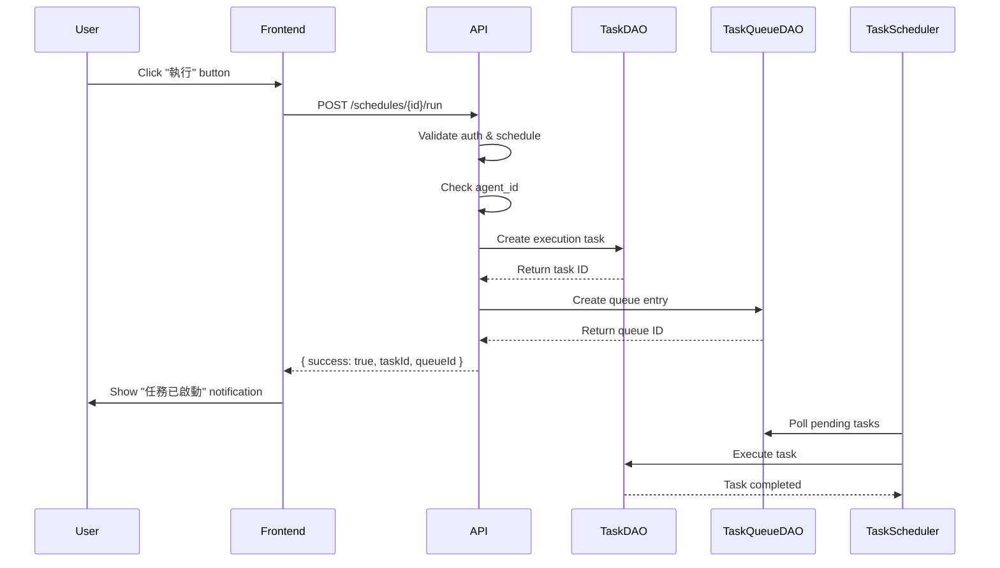

# Schedule Run Button Design

**Date**: 2026-04-07
**Status**: Approved
**Author**: OpenCode

## Overview

Add a "Run" button to the schedule UI that allows users to manually trigger immediate execution of a scheduled task. This creates a new task execution instance and queue entry, bypassing the `next_run_at` scheduling mechanism.

The button applies to both `method` and `message` schedules, providing manual control over when scheduled tasks run without waiting for their scheduled time.

## Problem Statement

Users currently have no way to manually trigger a scheduled task to run immediately. The only options are:
1. Wait for `next_run_at` time (automatic execution)
2. Edit the schedule expression
3. Use the "Refresh" button to recalculate `next_run_at`

This limitation prevents on-demand execution of scheduled tasks for testing, debugging, or urgent operational needs.

Additionally, schedules may have `agent_id = null` if the agent was deleted but the schedule wasn't cleaned up. The run button must handle this gracefully.

## Confirmed Requirements

- Run button applies to both `method` and `message` schedules
- Execution is asynchronous - creates task and queue entry, doesn't wait for completion
- Button position: in the actions area alongside Edit/Toggle/Refresh/Delete buttons
- Button label: "執行" (Chinese) via i18n key `agents.schedule.executeButton`
- Success feedback: notification message "任務已啟動"
- Error handling: show error message if execution fails
- Handle null `agent_id` gracefully with specific error message

## Backend Design

### New Endpoint

`POST /api/dashboard/schedules/{schedule_id}/run`

### Implementation Logic

1. **Authentication & Validation**
   - Require valid X-API-Key header
   - Load schedule context using `_load_schedule_context(schedule_id, user_id)`
   - Verify schedule ownership

2. **Agent ID Validation**
   - Check `task.agent_id` first
   - If null, check `payload.agent_instance_id`
   - If both are null, return 400 error with message `schedule_missing_agent`

3. **Create Execution Task**
   - Copy template task payload
   - Set `agent_id` (from `task.agent_id` or `payload.agent_instance_id`)
   - Set `status = TaskStatus.pending`
   - Set `parent_task_id = template_task.id` (link to template)
   - Preserve `user_id`, `task_type`, `priority`, `session_id`

4. **Create Queue Entry**
   - Set `task_id = execution_task.id`
   - Set `status = TaskStatus.pending`
   - Set `priority` based on template task priority (using `priority_to_int()`)
   - Set `scheduled_at = now_utc()` (immediately available)
   - Set `queued_at = now_utc()`

5. **Return Response**
   - HTTP 200 with `{ success: true, taskId: string, queueId: string }`

### Error Responses

- **401 Unauthorized**: Authentication failed
- **404 Not Found**: Schedule not found or not owned by user
- **400 Bad Request**: `{ error: "schedule_missing_agent" }` when agent_id is null

### Endpoint Registration

Add to `src/api/app.py` in `create_app()`:
```python
app.router.add_post("/api/dashboard/schedules/{schedule_id}/run", _dashboard_run_schedule)
```

## Frontend Design

### API Client

Add to `frontend/src/api/dashboard.ts`:

```typescript
export function executeSchedule(
  scheduleId: string,
): Promise<{ success: boolean; taskId?: string; queueId?: string }> {
  return mutateJson(`/api/dashboard/schedules/${scheduleId}/run`, "POST", {});
}
```

### ScheduleCard Component

Update `frontend/src/components/agents/ScheduleTab.tsx`:

- Add prop `onRun?: () => void`
- Modify actions rendering logic:
  - If `readOnly=true` and `onRun` exists: show only Run button
  - If `readOnly=false`: show all actions (Edit | Toggle | Refresh | Run | Delete)
- Add button in actions area:
  ```tsx
  <button type="button" onClick={onRun}>
    {t("agents.schedule.executeButton")}
  </button>
  ```
- Button order for message schedules: Edit | Toggle | Refresh | Run | Delete
- Button order for method schedules: Run (only this button shown)

### ScheduleTab Component

Add handler in `ScheduleTab`:

```typescript
async function handleRun(item: ScheduleItem) {
  setError(null);
  try {
    const response = await executeSchedule(item.id);
    if (response.success) {
      // Show success notification
      // Could use a toast/notification system or temporary message
      setError(null); // Clear any previous error
      // Optionally: trigger a refresh of schedules list
    }
  } catch (runError) {
    const message = runError instanceof Error ? runError.message : t("agents.schedule.runError");
    setError(message);
  }
}
```

Pass to ScheduleCard:

**Message schedules:**
```tsx
<ScheduleCard
  key={item.id}
  item={item}
  readOnly={false}
  onEdit={() => handleEdit(item)}
  onToggle={() => void handleToggle(item)}
  onRefresh={() => void handleRefresh(item)}
  onRun={() => void handleRun(item)}
  onDelete={() => void handleDelete(item)}
/>
```

**Method schedules:**
```tsx
<ScheduleCard
  key={item.id}
  item={item}
  readOnly={true}
  onRun={() => void handleRun(item)}
/>
```

Note: Method schedules remain read-only (no Edit/Toggle/Refresh/Delete), but still show Run button.

### i18n Keys

Add to translation files:

**Chinese (zh-HK):**
```json
{
  "agents.schedule.executeButton": "執行",
  "agents.schedule.runSuccess": "任務已啟動",
  "agents.schedule.runError": "執行失敗",
  "agents.schedule.missingAgentError": "排程缺少 Agent，請先設定 Agent"
}
```

**English:**
```json
{
  "agents.schedule.executeButton": "Run",
  "agents.schedule.runSuccess": "Task started",
  "agents.schedule.runError": "Execution failed",
  "agents.schedule.missingAgentError": "Schedule missing Agent, please configure Agent first"
}
```

### Notification/Feedback

Use existing error display mechanism with temporary success state:

**Implementation approach:**
1. Add a `successMessage` state variable alongside `error` state
2. When run succeeds:
   - Set `successMessage = t("agents.schedule.runSuccess")`
   - Clear `error`
   - Use `setTimeout` to clear `successMessage` after 3 seconds
3. Render success message in existing error area with different styling:
   ```tsx
   {successMessage ? (
     <div className="card settings-success">{successMessage}</div>
   ) : null}
   {error ? <div className="card settings-error">{error}</div> : null}
   ```

**CSS styling:**
- Add `.settings-success` class (green background/border, different from `.settings-error` red)
- Reuse existing error area layout, just different color scheme

**Alternative (future enhancement):** Implement a toast notification system for better UX, but out of scope for this design.

## Data Flow



## Testing

### Backend Tests

**File**: `tests/unit/test_api_app.py`

Add test cases:
1. **Valid schedule execution**:
   - Create schedule with valid agent_id
   - Call run endpoint
   - Assert HTTP 200 response
   - Assert task created with status=pending
   - Assert queue entry created
   - Assert returned taskId and queueId

2. **Missing agent_id**:
   - Create schedule with agent_id=null and no payload.agent_instance_id
   - Call run endpoint
   - Assert HTTP 400 with error "schedule_missing_agent"

3. **Non-existent schedule**:
   - Call run endpoint with invalid schedule_id
   - Assert HTTP 404

4. **Unauthorized access**:
   - Call run endpoint without valid API key
   - Assert HTTP 401

### Frontend Tests

**File**: `frontend/src/components/agents/__tests__/ScheduleTab.test.tsx`

Add test cases:
1. **Run button renders**:
   - Render ScheduleTab with schedules
   - Assert "執行" button visible in actions area

2. **Run button click success**:
   - Mock executeSchedule API response
   - Click Run button
   - Assert success notification displayed

3. **Run button click error**:
   - Mock executeSchedule API error
   - Click Run button
   - Assert error message displayed

4. **Missing agent error**:
   - Mock API returning "schedule_missing_agent" error
   - Click Run button
   - Assert specific error message shown

### Integration Test

1. Create a schedule in database
2. Click Run button in UI
3. Verify task appears in TasksPage with status running
4. Verify queue entry in task_queue table
5. Verify task completes successfully

## Security Considerations

- Endpoint requires authentication (X-API-Key)
- Schedule ownership verified (user_id match)
- No exposure of internal task IDs to unauthorized users
- Queue entry creation follows same security model as scheduler

## Performance Considerations

- Asynchronous execution: no blocking wait for task completion
- Minimal database writes: 2 inserts (task + queue)
- No impact on scheduler performance: queue entry picked up naturally by scheduler tick

## Out of Scope

- Synchronous execution with result waiting
- Bulk execution of multiple schedules
- Execution history/logs viewing
- Schedule execution scheduling changes (only immediate execution)
- Notification system implementation (uses existing error display)

## Future Enhancements

- Execution history tab showing manual runs
- Bulk run functionality for multiple schedules
- Real-time execution status updates (WebSocket)
- Execution result preview in schedule card